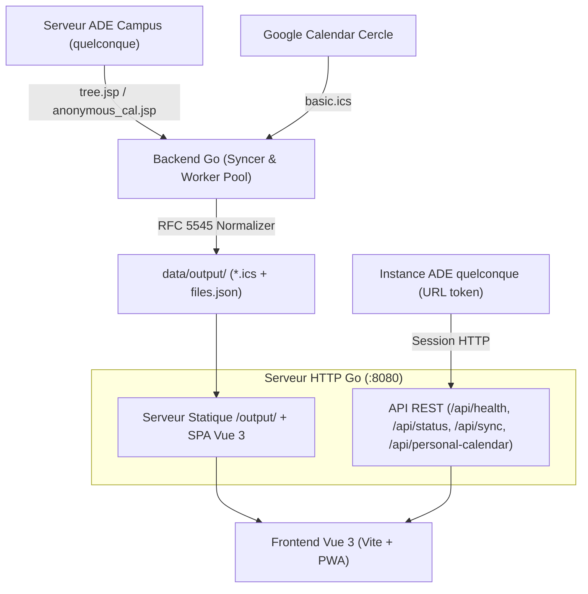

# 📅 ICSExplorer — Emplois du temps universitaires


Application moderne et conteneurisée pour consulter, rechercher et synchroniser les emplois du temps universitaires au format ICS (iCalendar).
Conçue initialement pour **Grenoble INP — Esisar**, elle supporte désormais **n'importe quelle instance ADE Campus** via son mode planning personnel.

---

## ✨ Fonctionnalités

### 🗓️ Grille hebdomadaire
- **Vue semaine** avec défilement swipe mobile, ligne rouge temps réel et navigation clavier (`←` `→` `T`)
- **Gestion des chevauchements** : affichage côte à côte optimisé pour les cours parallèles
- **Skeletons UI animés** (shimmer) zéro-CLS pendant le chargement
- **Modal de détail** au clic sur un cours (titre, horaires, salle, description complète)

### 🎨 Coloration intelligente des cours
- **Détection automatique de la discipline** par mots-clés (Informatique, Management, Langues, Mathématiques, Physique, Sport…) — fonctionne pour tous les établissements
- **Palette harmonieuse de 10 couleurs** attribuée de façon **déterministe** par titre de cours normalisé : deux occurrences du même cours auront toujours la même couleur, quelle que soit la semaine
- **Normalisation des titres** : préfixes `CM/TD/TP`, symboles `***`, numéros de groupe `- Groupe 1` sont ignorés pour assurer la cohérence des couleurs
- Adaptation complète **mode clair / mode sombre** (translucide avec bordure d'accent vive)

### 📊 Statistiques hebdomadaires
- Barre de répartition du temps par discipline (% et durée)
- **Filtre interactif** : cliquer sur une discipline isole les cours correspondants dans la grille

### 🌐 Planning personnel — Explorer n'importe quelle instance ADE
- Coller l'**URL de planning direct ADE** de son établissement (format `index.jsp?data=…`) suffit
- **Explorateur d'arborescence** : navigation dans les catégories/filières/groupes de l'instance ADE choisie, avec fil d'Ariane
- Sélection d'un dossier ou d'une feuille pour charger l'emploi du temps correspondant directement
- **"Changer de planning"** rouvre l'explorateur à la racine de l'instance déjà configurée sans ressaisie d'URL
- Identifiants stockés localement uniquement (jamais transmis au serveur autre qu'ADE)

### 🏫 Salle libres
- Détection des salles disponibles à un créneau donné en croisant tous les plannings de l'établissement

### ⚡ Backend Go & Scraper ADE
- **Scraping dynamique de l'arbre ADE** (`tree.jsp`) : exploration récursive, détection automatique de l'année scolaire
- **Worker Pool concurrent** : téléchargement parallèle contrôlé avec retries exponentiels
- **Formatage iCalendar (RFC 5545)** : nettoyage des `SUMMARY`, `LOCATION`, `DESCRIPTION`
- **Fusion agenda Cercle** : intégration optionnelle de l'agenda Google Calendar public du Cercle des élèves
- **API Health** (`/api/health`) : `200 OK` si données fraîches (<24h), `503` avec diagnostic JSON sinon
- **Scheduler intégré** : synchronisation périodique sans cron externe

### 📱 PWA Installable & Offline
- **Icônes PNG 192×192 et 512×512** (`any` + `maskable` pour Android adaptatif)
- `display_override: ["window-controls-overlay", "standalone"]` pour l'expérience desktop
- **Service Worker v21** : cache-first pour les assets Vite, network-first pour l'API, fallback offline complet
- Installable sur Android, iOS et desktop (Chrome/Edge)

---

## 🏗️ Architecture



---

## 🚀 Démarrage Rapide

### 1. Docker Compose (Recommandé)

```bash
git clone https://github.com/Rem7474/ICSExplorer.git
cd ICSExplorer
cp .env.example .env
# Éditer .env avec vos identifiants Agalan (Grenoble INP) si nécessaire
docker compose up -d
```

Application disponible sur **`http://localhost:8080`**.

### 2. Développement Local

**Prérequis :** Go 1.22+ · Node.js 20+ · npm

```bash
# Frontend (proxy → API Go)
cd frontend && npm install && npm run dev

# Backend (autre terminal)
go run ./cmd/server
```

---

## ⚙️ Configuration (`.env`)

| Variable | Description | Défaut |
|---|---|---|
| `PORT` | Port HTTP | `8080` |
| `AGALAN_LOGIN` | Identifiant Agalan (Grenoble INP) | *vide* |
| `AGALAN_PASSWORD` | Mot de passe Agalan | *vide* |
| `SYNC_INTERVAL` | Intervalle de synchronisation auto | `30m` |
| `SYNC_ON_STARTUP` | Synchro au démarrage | `true` |
| `SYNC_CERCLE` | Fusionner l'agenda Cercle | `true` |
| `CONCURRENCY` | Workers de téléchargement concurrent | `5` |
| `MAX_DATA_AGE` | Seuil d'obsolescence `/api/health` | `24h` |
| `MIN_FILE_SIZE_BYTES` | Taille minimale ICS attendue | `50000` |
| `LOG_LEVEL` | Niveau de log (`debug`/`info`/`warn`/`error`) | `info` |
| `LOG_FORMAT` | Format (`text`/`json`) | `json` |
| `ADMIN_TOKEN` | Bearer token pour `POST /api/sync` | *vide* |

---

## 📡 API REST

| Endpoint | Méthode | Description |
|---|---|---|
| `/api/health` | GET | Santé & fraîcheur des données (`200` OK / `503` KO) |
| `/api/status` | GET | Statistiques de synchronisation et configuration |
| `/api/sync` | POST | Déclenche une synchro (Bearer token si `ADMIN_TOKEN` configuré) |
| `/api/files` | GET | Liste JSON des emplois du temps disponibles |
| `/output/{nom}.ics` | GET | Téléchargement ICS avec cache HTTP & ETag |
| `/api/personal-calendar` | POST | Récupère le planning personnel via une instance ADE (voir ci-dessous) |

### `POST /api/personal-calendar`

Récupère l'emploi du temps d'un étudiant en se connectant à une instance ADE Campus quelconque.

```json
{
  "adeUrl": "https://ade-uga-ro-vs.grenet.fr/direct/index.jsp?data=TOKEN…,1",
  "login": "prenom.nom@univ.fr",
  "password": "••••",
  "resourceIds": ["28978"],
  "branchPath": ["1674", "27615", "28793"]
}
```

- `adeUrl` : URL de planning direct ADE de l'établissement
- `resourceIds` : IDs des ressources feuilles (groupes/filières) à exporter
- `branchPath` : chemin des nœuds parents à ouvrir dans la session pour atteindre les ressources
- Réponse : calendrier ICS (`text/calendar`) ou `401` (identifiants refusés) / `502` (serveur ADE injoignable)

> **Confidentialité** : les identifiants ne sont utilisés qu'en mémoire pour la requête ADE et ne sont jamais écrits sur disque, mis en cache ni loggés côté serveur.

### `POST /api/personal-calendar/tree`

Explore l'arborescence d'une instance ADE Campus.

```json
{
  "adeUrl": "https://...",
  "login": "...",
  "password": "...",
  "category": "trainee",
  "branchPath": ["1674", "27615"]
}
```

Réponse : tableau JSON de nœuds `{ id, name, isLeaf }`.

---

## 🧪 Tests & Qualité

```bash
# Tous les tests (Go + Vitest)
make test

# Backend Go uniquement
go test -v ./...

# Frontend uniquement
cd frontend && npm test

# Linter Go
golangci-lint run ./...
```

**Couverture actuelle :**
- ✅ 58 tests Vitest (frontend Vue 3 + composables + utils)
- ✅ Packages Go : `ade`, `server`, `syncer`, `university`, `ics`, `config`, `guard`

---

## 🔄 CI/CD (GitHub Actions)

1. **`ci.yml`** : tests Go (race detector), Vitest, build Vite, lint, build Docker + scan Trivy
2. **`release.yml`** : build multi-arch (`amd64`/`arm64`), publication sur `ghcr.io`, binaires standalone (Linux/macOS/Windows) sur tag `v*.*.*`

---

## 📄 Licence

Distribué sous licence **GPL-3.0**. Voir [LICENSE](LICENSE).