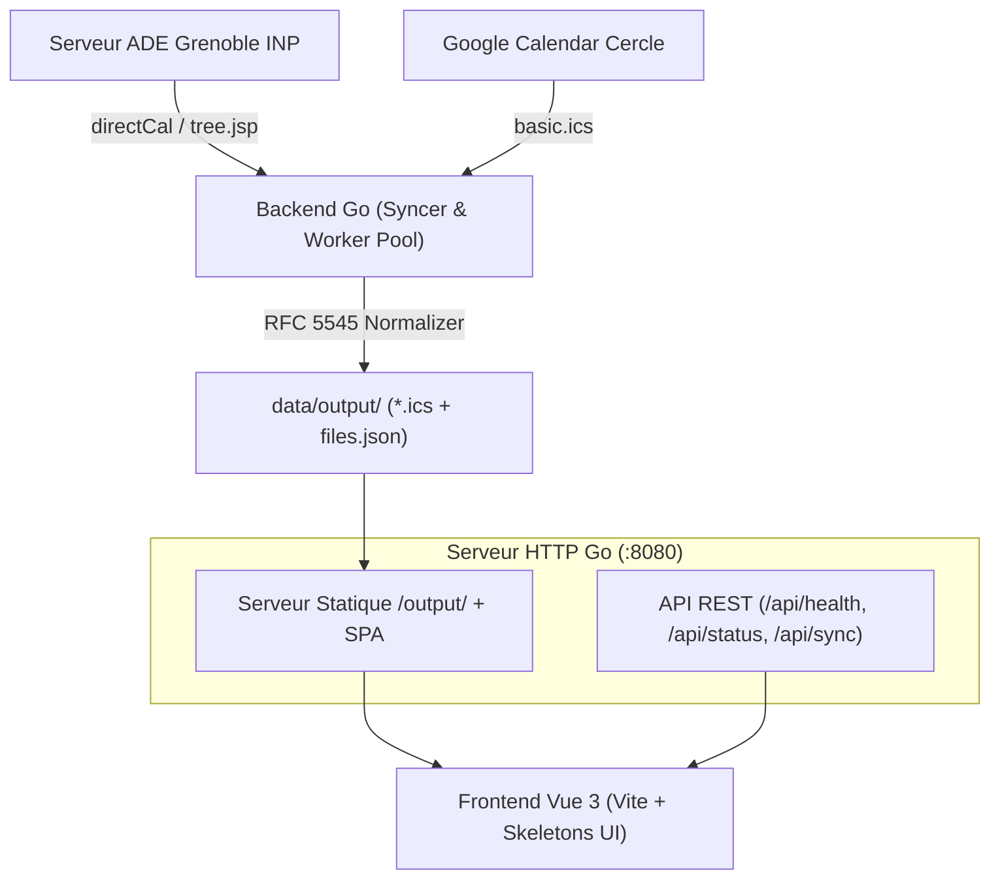

# 📅 ICSExplorer — Emploi du Temps ESISAR (v2.0)


Application moderne et conteneurisée pour consulter, rechercher et synchroniser les emplois du temps de l'école **Esisar (Grenoble INP)**.
Elle intègre un **frontend réactif en Vue 3**, un **scraper/serveur haute performance en Go**, une suite de **tests complets**, et un pipeline **CI/CD production-ready**.

---

## ✨ Fonctionnalités Clés

### 🎨 Frontend Réactif (Vue 3 + Vite)
- **Skeletons UI animés (Shimmer)** : Zéro effet de saccade (CLS) pendant le chargement des plannings, de la carte prochain cours et des statistiques.
- **Recherche instantanée & Auto-complétion** : Accès direct à sa filière, un professeur ou une salle sans passer obligatoirement par les 4 sélecteurs en cascade.
- **Filtres interactifs par matière** : Clic sur une puce matière (ex: `IN`, `SN`, `LV`, `Sport`) dans les statistiques hebdomadaires pour isoler / filtrer les cours correspondants sur la grille.
- **Grille avec gestion des collisions** : Affichage côte à côte optimisé pour les cours en parallèle (colonne sub-layout).
- **Navigation mobile optimisée** : Défilement swipe horizontal avec points d'étape par jour et affichage de la ligne rouge de l'heure en temps réel.
- **Thème sombre / clair persistant** avec respect automatique des préférences système (`prefers-color-scheme`).
- **Feuille de style d'impression (`@media print`)** : Export PDF ou impression propre en A4 paysage sans boutons ni en-têtes superflus.
- **PWA installable & Offline** : Cache Service Worker (stratégies network-first et stale-while-revalidate) et notifications de cours.
- **Salles libres instantanées** : Outil de détection des salles disponibles à un créneau horaire en croisant l'ensemble des plannings.

### ⚡ Backend Go & Scraper ADE
- **Scraping dynamique de l'arbre ADE (`tree.jsp`)** : Exploration récursive tolérante aux espaces (`\s*-\s*`), détection dynamique de l'année scolaire (`YYYY-YYYY+1`), et fallback automatique sur les listes statiques (`data/IDS.txt`, `data/Rooms-IDS.txt`).
- **Worker Pool concurrent** : Téléchargement parallèle contrôlé (concurrence paramétrable via `CONCURRENCY`) avec retries exponentiels.
- **Formatage & Nettoyage iCalendar (RFC 5545)** : Simplification automatique des `SUMMARY`, `LOCATION` (`_CM`, `(V)`), et reformulation propre de la `DESCRIPTION` (Kholles avec colleur/horaires, cours de soutien CPGE/IUT, projets, groupes TP/TD).
- **Fusion de l'agenda Cercle** : Téléchargement et intégration optionnelle des événements de l'agenda Google Calendar public du Cercle des élèves.
- **Surveillance de Fraîcheur & API Health** : Endpoint `/api/health` renvoyant `200 OK` si les données sont saines et fraîches (< 24h) ou `503 Service Unavailable` avec diagnostic JSON en cas d'anomalie.
- **Scheduler intégré** : Synchronisation périodique automatique sans dépendre de cron externe.

---

## 🏗️ Architecture du Projet



---

## 🚀 Démarrage Rapide

### 1. Déploiement avec Docker Compose (Recommandé)

```bash
# 1. Cloner le dépôt
git clone https://github.com/Rem7474/ICSExplorer.git
cd ICSExplorer

# 2. Configurer les variables d'environnement
cp .env.example .env
# Éditer .env avec vos identifiants Agalan (Grenoble INP) si vous souhaitez synchroniser avec ADE

# 3. Lancer le conteneur en arrière-plan
docker compose up -d

# 4. Vérifier les logs et l'état
docker compose logs -f
```

L'application est disponible sur **`http://localhost:8080`**.

---

### 2. Développement Local

#### Prérequis :
- **Go 1.22+**
- **Node.js 20+** et **npm**

#### Lancement en mode développement :

```bash
# Compiler et lancer le frontend en mode dev (avec proxy vers l'API Go)
cd frontend
npm install
npm run dev

# Dans un autre terminal, lancer le backend Go
go run ./cmd/server
```

---

## ⚙️ Configuration (`.env`)

| Variable | Description | Valeur par défaut |
|---|---|---|
| `PORT` | Port d'écoute du serveur HTTP | `8080` |
| `AGALAN_LOGIN` | Identifiant Agalan (Grenoble INP) | *vide* |
| `AGALAN_PASSWORD` | Mot de passe Agalan (Grenoble INP) | *vide* |
| `SYNC_INTERVAL` | Intervalle de synchronisation automatique | `30m` |
| `SYNC_ON_STARTUP` | Lancer une synchro au démarrage | `true` |
| `SYNC_CERCLE` | Télécharger et fusionner les événements Cercle | `true` |
| `CONCURRENCY` | Nombre de workers concurrents de téléchargement | `5` |
| `MAX_DATA_AGE` | Seuil d'obsolescence pour `/api/health` | `24h` |
| `MIN_FILE_SIZE_BYTES` | Taille minimale attendue pour un ICS | `50000` |
| `LOG_LEVEL` | Niveau de log (`debug`, `info`, `warn`, `error`) | `info` |
| `LOG_FORMAT` | Format des logs (`text`, `json`) | `json` (en prod) |
| `ADMIN_TOKEN` | Jeton Bearer optionnel pour sécuriser `POST /api/sync` | *vide* |

---

## 📡 Endpoints API REST

### `GET /api/health`
Vérifie la santé et la fraîcheur des fichiers calendriers.
- **Code 200 OK** : Données à jour et intègres.
- **Code 503 Service Unavailable** : Données obsolètes ou fichier manquant.

```json
{
  "status": "healthy",
  "fresh": true,
  "last_sync": "2026-08-30T18:00:00Z",
  "last_sync_age": "5m",
  "files_count": 85,
  "max_data_age": "24h0m0s",
  "uptime": "12h30m",
  "uptime_seconds": 45000
}
```

### `GET /api/status`
Retourne les statistiques détaillées de synchronisation et la configuration active.

### `POST /api/sync`
Déclenche une synchronisation en arrière-plan. (Protégé par `Authorization: Bearer <ADMIN_TOKEN>` si configuré).

### `GET /api/files`
Retourne la liste JSON triée de tous les emplois du temps étudiants disponibles.

### `GET /output/{nom}.ics`
Téléchargement direct du calendrier avec support du cache HTTP et en-tête `ETag`.

---

## 🧪 Tests & Qualité

```bash
# Exécuter tous les tests (Backend Go + Frontend Vitest)
make test

# Tests unitaires Backend uniquement
go test -v ./...

# Tests unitaires Frontend uniquement
cd frontend && npm test

# Linter Go
golangci-lint run ./...
```

---

## 🔄 Pipeline CI/CD

Le projet intègre des workflows **GitHub Actions** complets :
1. **`.github/workflows/ci.yml`** :
   - Exécution des tests Go avec détection de race conditions (`-race`).
   - Exécution des tests Vitest & validation du build Vite.
   - Linting Go (`golangci-lint`).
   - Build de l'image Docker & scan de vulnérabilités avec **Trivy**.
2. **`.github/workflows/release.yml`** :
   - Build Docker multi-architecture (`linux/amd64`, `linux/arm64`) avec Docker Buildx.
   - Publication automatique sur GitHub Container Registry (`ghcr.io`).
   - Compilation et publication des binaires standalone (Linux, macOS, Windows) lors de la création d'un tag `v*.*.*`.

---

## 📄 Licence

Distribué sous licence **GPL-3.0**. Consultez [LICENSE](LICENSE) pour plus d'informations.
